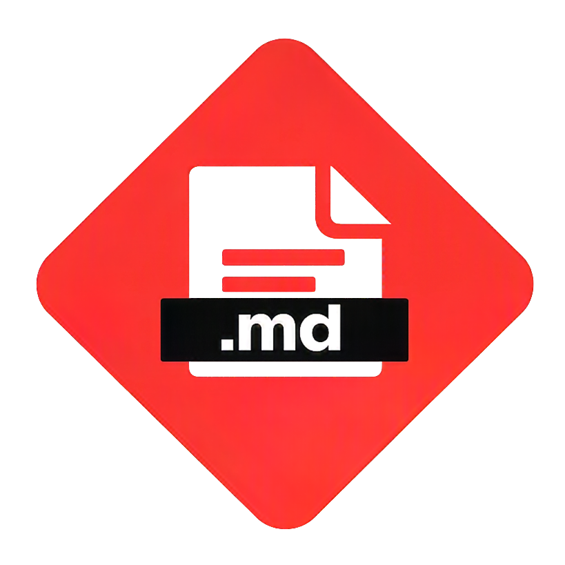
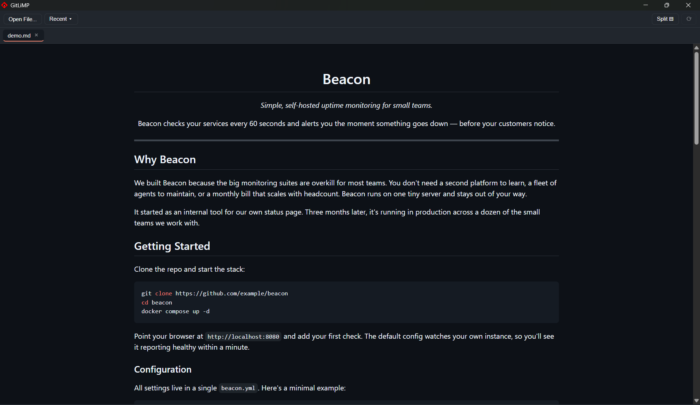
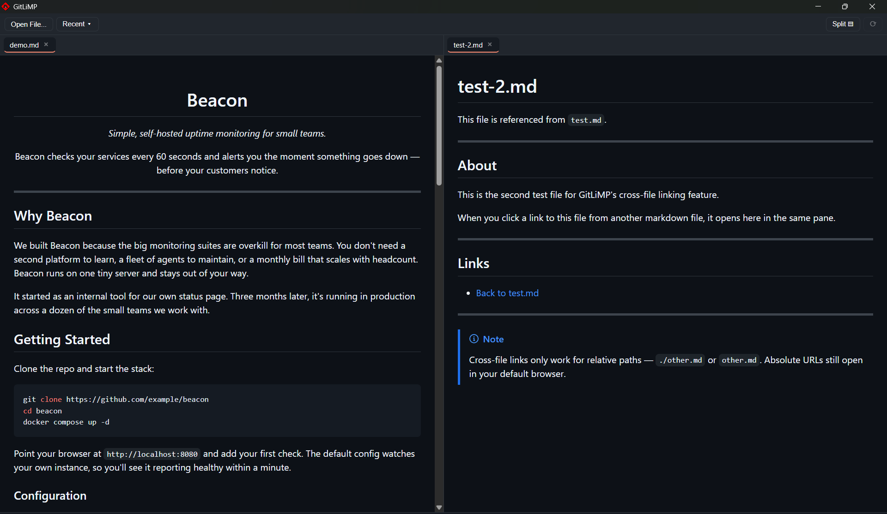
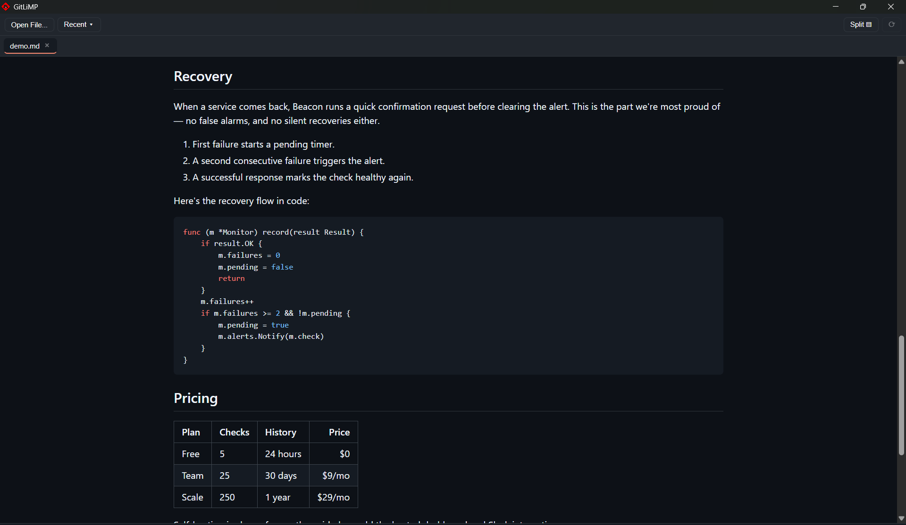

<div align="center">



# GitLiMP

*A **Git**Hub **Li**ve **M**arkown **P**reviewer — Previews Markdown files live without having to constantly push changes to GitHub.*

Built with **Go + Wails v2** and a framework-free **vanilla JS + markdown-it** frontend.

Available on Windows.

**[Try the live web demo →](https://velo4705.github.io/gitlimp/)**



</div>

---

## How It Works

**Simple.** Just open a **Markdown file** from any project you're working on. GitLiMP tracks changes in real-time as you edit and save. It even has a Split View feature that lets you compare two documents **side-by-side**.

This software is solely made to **preview markdown files live** while editing in your preferred editor, while applying **GitHub-rich rendering** to provide what you see on GitHub without having to keep pushing changes to GitHub just because of the Markdown file.

The **Recent Files** feature allows you to quickly switch between recently opened files... and can be **cleared** if its cluttered.

### Key Features

<div align="center">
  <table>
    <tr>
      <td align="center"><br><b>Split View</b></td>
      <td align="center"><br><b>Dark Mode Rendering</b></td>
    </tr>
  </table>
</div>

## Keybinds

| Action | Key |
|-----|--------|
| Open Files | `Ctrl+O` |
| Toggle Split View | `Ctrl+\` |


## Building

Prerequisites: Go, Node.js, [Wails CLI](https://wails.io/docs/gettingstarted/installation).

```bash
wails build -trimpath -ldflags "-s -w"
```

The binary is produced at `build/bin/gitlimp.exe` (Windows) or `build/bin/gitlimp` (Linux).

## Footprint

| Metric | Value |
|---|---|
| Binary size (stripped) | ~16.3 MB |
| NSIS installer | ~8.3 MB (includes WebView2 bootstrapper) |
| Idle memory (working set) | ~40 MB |
| Go direct dependencies | 4 |

## License

MIT
