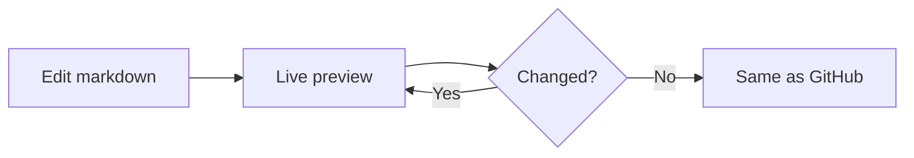

# Welcome to the GitLiMP Playground

**Git Live Markdown Previewer** — this playground uses the exact same rendering pipeline as the desktop app: `markdown-it` with the GitHub flavor, `github-markdown-css`, syntax highlighting, Mermaid diagrams, and KaTeX math.

Edit the markdown on the left and watch the preview update live, just like GitLiMP does on your own machine.

[](https://opensource.org/licenses/MIT)

---

## Typography

This is **bold**, *italic*, ~~strikethrough~~, and `inline code`.

> [!NOTE]
> GitHub-style alerts render natively, just like on GitHub.com.

### Inline HTML tags

Press <kbd>Ctrl</kbd> + <kbd>S</kbd> to save.

Chemical formula: H<sub>2</sub>O and x<sup>2</sup>.

---

## Tables

| Feature | GitLiMP | GitHub |
|:--------|:-------:|:------:|
| Live preview | ✅ | — |
| Mermaid diagrams | ✅ | ✅ |
| KaTeX math | ✅ | ✅ |
| Offline | ✅ | ❌ |

---

## Code with syntax highlighting

```go
func main() {
    fmt.Println("Hello, GitLiMP!")
}
```

```python
def greet(name):
    return f"Hello, {name}!"
```

---

## Mermaid diagram



---

## Math with KaTeX

Inline math $E = mc^2$ and a block:

$$
\int_{-\infty}^{\infty} e^{-x^2}\,dx = \sqrt{\pi}
$$

---

## Task list

- [x] Render markdown like GitHub
- [x] Live preview while editing
- [ ] Ship the desktop app
- [ ] Star the repo

---

Try it out: edit anything above, or click **Load Sample** to switch content, or **Open Local File** to preview one of your own `.md` files.