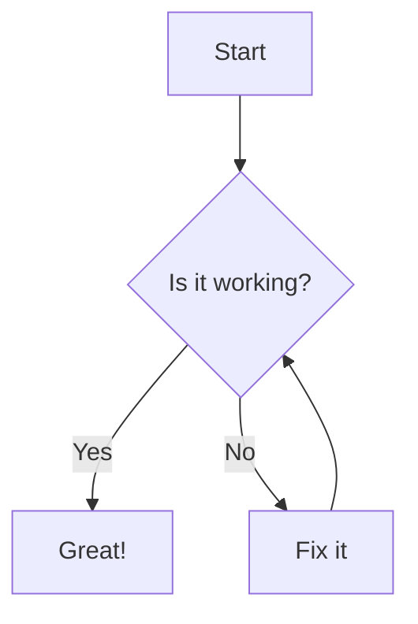

<div align="center">

# GitLiMP Test File

**Git Live Markdown Previewer** — this file exercises every GitHub markdown trick supported.

[](https://opensource.org/licenses/MIT)
[](https://go.dev/)
[](http://makeapullrequest.com)

</div>

---

## Local Image

This image is loaded from disk (not the internet):


---

## Typography

This is **bold**, *italic*, ~~strikethrough~~, and `inline code`.

> Blockquote: GitLiMP renders markdown exactly as GitHub does.

### Inline HTML tags

Press <kbd>Ctrl</kbd> + <kbd>S</kbd> to save.

Chemical formula: H<sub>2</sub>O and x<sup>2</sup>.

Use <mark>highlighted text</mark> and <ins>inserted text</ins> and <del>deleted text</del>.

---

## Links

- Inline: [GitHub](https://github.com)
- Bare URL autolink: https://github.com
- `www` autolink: www.github.com
- Email autolink: support@github.com
- Reference-style: [markdown-it][md-it]

[md-it]: https://github.com/markdown-it/markdown-it

---

## Heading anchors

Jump straight to the [Mermaid section](#mermaid). Hover any heading to see the `#` link.

### Nested heading example

Deep link to this heading via `#nested-heading-example`.

---

## Lists

- Unordered item one
- Unordered item two
  - Nested item

1. Ordered first
2. Ordered second
   1. Nested ordered

---

## Tables

| Feature | Status | Notes |
|---------|--------|-------|
| Tables  | ✅ | Native |
| Badges  | ✅ | shields.io |
| HTML    | ✅ | Passthrough |

### Aligned columns

| Left | Center | Right |
|:-----|:------:|------:|
| a    | b      | c     |

### Blocks inside table cells

| Type | Example |
|------|---------|
| Image |  |
| List | 1. First item<br>2. Second item |
| Code | `inline` |

---

## Code Blocks

```go
package main

import "fmt"

func main() {
    fmt.Println("Hello from GitLiMP")
}
```

### Diff blocks

```diff
+ added line (green)
- removed line (red)
  unchanged line
```

---

## Task List

- [x] Milestone 0 — Environment
- [x] Milestone 1 — Load & Render
- [x] Milestone 2 — Live Preview
- [ ] Milestone 3 — Live Preview v2.0
- [ ] Milestone 4 — Do nothing. :>

---

## Footnotes

Here is a statement with a footnote[^1] and another[^2].

[^1]: This is the first footnote.

[^2]: The second footnote lives here.

---

## Alerts

> [!NOTE]
> Highlights information that users should take into account.

> [!TIP]
> Optional info to help a user be more successful.

> [!IMPORTANT]
> Crucial information necessary for users to succeed.

> [!WARNING]
> Critical content demanding attention.

> [!CAUTION]
> Negative potential consequences of an action.

---

## Math

Inline math: $E = mc^2$

Block math:

$$
\int_0^\infty e^{-x^2} dx = \frac{\sqrt{\pi}}{2}
$$

---

## Emoji

:smile: :rocket: :tada: :+1:

---

## Collapsible HTML

<details>
  <summary>Click to expand</summary>

  Hidden content with **markdown** inside.

  ```go
  fmt.Println("works here too")
  ```

</details>

<details open>
  <summary>Expanded by default</summary>

  Visible without clicking.

</details>

---

## Picture (dark / light)

GitHub swaps this image based on color scheme:

<picture>
  <source media="(prefers-color-scheme: dark)" srcset="media/image_for_test.png">
  
</picture>

---

## Mermaid



---

## Cross-file Links

Open [test-2.md](test-2.md) to jump to the second test file.
